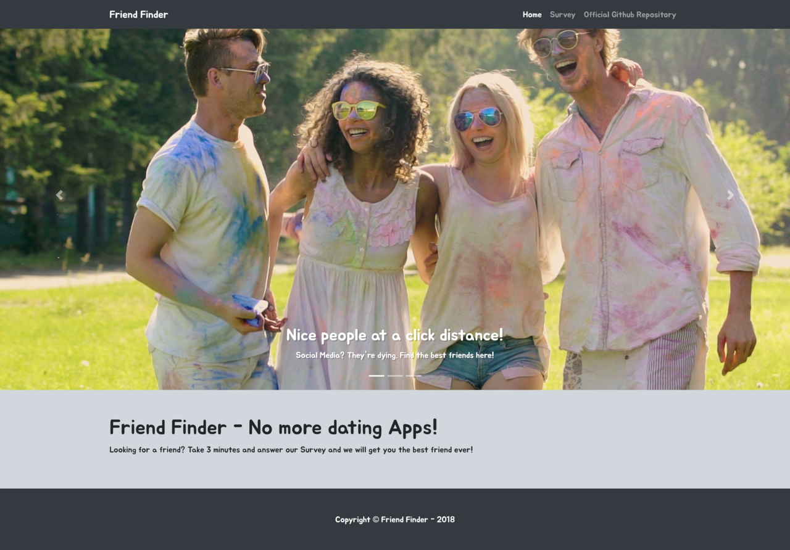

# Friendfinder - Built with Node.js, Javascript, HTML, CSS and jQuery 



To enhance my knowledge on Node.js together with Javascript, HTML and CSS, I created a Matchmaking friend-style app! 

## Getting Started :floppy_disk:

### Prerequisites :open_file_folder:
Make sure you have node.js installed on your computer! You can download it via the installer on the official site
```
https://nodejs.org/en/download/
```
Then either clone or download this repo.

The deployed version of this app is hosted on heroku [here](https://damp-refuge-32889.herokuapp.com/)

To view this app locally on your machine type `node server.js` into your terminal to intialize the app. This will set up a local server on your computer. Navigate to the server in your browser by visiting `http://localhost:8080/`

To end the sever connection simply hold down `ctrl + c` inside of your terminal.

## Built With :crescent_moon:
* HTML5 & CSS3
* [Bootstrap](https://getbootstrap.com/) - CSS framework
* [Boostrap Sliders](http://seiyria.com/bootstrap-slider/) - slider
* [Javascript](https://www.javascript.com/) - programming language
* [Node.js](https://nodejs.org/en/) - javascript runtime
* [Express.js](https://expressjs.com/) - routing framework

### NPM Packages
* [Express](https://www.npmjs.com/package/express)
* [body-parser](https://www.npmjs.com/package/body-parser)
* [Nodemon](https://www.npmjs.com/package/nodemon)
* [Path](https://www.npmjs.com/package/path)

## Author :key:
* **Gustavo Gibo** - [gustavogibo](https://github.com/gustavogibo)